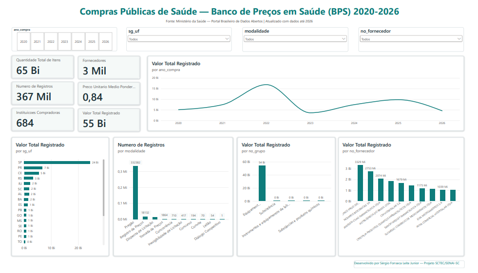

# Dashboard de Compras Públicas de Saúde — Banco de Preços em Saúde (BPS) 2020–2026

> Mini-Projeto Avaliativo — Módulo 2 (Visualização de Dados e Business Intelligence) — SCTEC/SENAI-SC
> Autor: Sérgio Fonseca Leite Junior

## 1. Objetivo do projeto

Este projeto entrega um dashboard analítico em Power BI para acompanhar as compras públicas de medicamentos e dispositivos médicos registradas no Banco de Preços em Saúde (BPS) entre 2020 e 2026. Destina-se a gestores públicos, analistas de compras e instituições de saúde que precisam comparar preços, identificar concentrações de gasto por estado, fornecedor e modalidade, e apoiar decisões de planejamento e negociação.

<!-- Em 3-4 linhas: o que o dashboard entrega e para quem. -->

## 2. Contextualização do problema

A gestão eficiente de recursos públicos na área da saúde exige acompanhar um grande volume de compras, envolvendo múltiplos fornecedores, modalidades de aquisição e uma ampla variedade de medicamentos e dispositivos médicos. Sem ferramentas de visualização, essas informações ficam dispersas em bases brutas, dificultando a identificação de padrões, variações de preço relevantes e oportunidades de negociação. Este projeto usa Visualização de Dados e Business Intelligence para transformar os dados públicos do BPS
em indicadores e análises que apoiam esse acompanhamento.

<!-- Por que preços/compras públicas de saúde importam. Reaproveite o contexto do BPS. -->

## 3. Fonte dos dados

- Banco de Preços em Saúde (BPS) — Ministério da Saúde
- Portal Brasileiro de Dados Abertos: https://dadosabertos.saude.gov.br/dataset/bps
- Dicionário de dados oficial: https://dadosabertos.saude.gov.br/dataset/bps/resource/0e76f527-5e7e-417d-9d0b-f46d00afb717
- Período utilizado: arquivos anuais .csv de 2020 a 2026 (7 arquivos)

## 4. Procedimentos para baixar e concatenar as bases

<!-- Passo a passo real do que você fez: onde baixou, como nomeou os arquivos, ferramenta usada para concatenar (python/excel/power query), link do script (scripts/concatenar_bases.py). -->

## 5. Tratamentos e transformações realizadasano_compra

- Leitura dos 7 arquivos anuais (2020-2026) com separador `;` e encoding UTF-8.
- Verificação de estrutura: os 7 anos apresentam schema idêntico (36 colunas, mesmos nomes de coluna em todos os anos) — nenhuma discrepância de nomenclatura ou de colunas ausentes/extras entre os anos.
- Observação relevante: o volume de registros cai de forma expressiva a partir de 2023. Anos 2020-2022 concentram entre ~85 mil e ~90 mil registros/ano, enquanto 2023-2025 apresentam entre ~28 mil e ~34 mil registros/ano, e 2026 (parcial, ano em curso) tem 11 mil registros até o momento da coleta.
- Verificação de valores nulos: identificados nulos estruturais e esperados em campos que não se aplicam a todo item (ex: `vl_capacidade`, `un_fornecimento`, `registro_anvisa`, `nu_ata`, `ds_observacao`) — mantidos como estão, pois representam ausência real de informação, não erro. Nenhum nulo encontrado nas colunas usadas nos KPIs principais (valor total, preço unitário, quantidade, fornecedor).
- Encontrados nulos pontuais em `no_instituicao` (8 a 95 registros por ano, conforme o ano), coluna usada no KPI "Instituições compradoras". Como essas linhas mantêm valores financeiros válidos, optou-se por preencher com o rótulo "Não informado" em vez de remover o registro, evitando perda de dado financeiro real por causa de um único campo ausente.
- Verificação de registros duplicados: nenhuma linha duplicada encontrada nos 7 anos, tanto considerando todas as colunas quanto a chave única de registro (`co_seq_bps`), que se confirmou sem repetições em nenhum dos anos.
- Conversão de tipos: `dt_compra` e `dt_insercao` vieram como texto (`str`, formato dd/mm/aaaa) e foram convertidas para tipo data (`datetime64`) com `pd.to_datetime`. Validado que o intervalo de datas de cada ano corresponde ao ano do arquivo (ex: 2020 varia de 01/01/2020 a 31/12/2020, sem valores fora da faixa). As colunas numéricas (`vl_preco_unitario`, `vl_preco_total`, `qt_medicamento`) já vieram corretamente tipadas na leitura original.
- Identificação e tratamento de outliers extremos: durante a análise no Power BI, o cartão "Valor Total Registrado" apresentou um valor de aproximadamente R\$ 10 trilhões — incompatível com a escala real de compras públicas de saúde no Brasil. Isso motivou o retorno ao notebook de tratamento (VS Code) para investigação da causa. Identificou-se que 7 registros (de 367.443) apresentavam vl_preco_total acima de R\$ 1 bilhão numa única compra, somando R\$ 60,4 bilhões — valor incompatível com o preço real de mercado dos itens envolvidos (ex: amoxicilina genérica a R\$ 51.038,16 por unidade, insulina NPH a R\$ 45.715,00 por unidade). O padrão é consistente com erro de captura/digitação na base pública original, não com preços de mercado reais. Esses 7 registros foram removidos da base tratada, e a base consolidada foi regravada e recarregada no Power BI (base final: 367.436 registros).
- Correção de tipo de dado no Power BI: as colunas `vl_preco_total`, `vl_preco_unitario`, `vl_capacidade` e `qt_medicamento` foram importadas inicialmente como texto pelo Power Query; a conversão para tipo numérico usando localidade "Inglês (Estados Unidos)" corrigiu a interpretação do separador decimal, alinhando os valores do dashboard com os calculados em Python.

<!-- Encoding, nulos, duplicados, padronização de colunas, datas, valores monetários. Liste discrepâncias entre anos e como foram resolvidas (ver docs/discrepancias-entre-anos.md). -->

## 6. Descrição das principais colunas utilizadas

| Coluna            | Descrição                                                               | Tipo                |
| ----------------- | ------------------------------------------------------------------------- | ------------------- |
| ano_compra        | Ano de referência da compra (2020 a 2026)                                | Numéricogit add .  |
| sg_uf             | Sigla do estado (UF) da instituição compradora                          | Texto               |
| dt_compra         | Data em que a compra foi realizada                                        | Data                |
| ds_item           | Descrição do medicamento/dispositivo médico adquirido                  | Texto               |
| no_grupo          | Categoria/grupo ao qual o item pertence (ex: Equipamentos, Subsistência) | Texto               |
| no_instituicao    | Nome da instituição compradora                                          | Texto               |
| no_fornecedor     | Nome do fornecedor da compra                                              | Texto               |
| no_fabricante     | Nome do fabricante do item                                                | Texto               |
| modalidade        | Modalidade de compra utilizada (Pregão, Dispensa de Licitação etc.)    | Texto               |
| qt_medicamento    | Quantidade adquirida na compra                                            | Numérico           |
| vl_preco_unitario | Preço unitário do item na compra                                        | Numérico (decimal) |
| vl_preco_total    | Valor total da compra (preço unitário × quantidade)                    | Numérico (decimal) |

## 7. Definição dos KPIs e métricas

| KPI                            | Fórmula/Lógica (DAX)                                            | Observação                                                     |
| ------------------------------ | ----------------------------------------------------------------- | ---------------------------------------------------------------- |
| Valor Total Registrado         | `SUM(BPS_20_26_SergioLeite[vl_preco_total])`                    | Soma de todas as compras, após remoção de 7 outliers extremos |
| Quantidade Total de Itens      | `SUM(BPS_20_26_SergioLeite[qt_medicamento])`                    |                                                                  |
| Numero de Registros            | `COUNTROWS(BPS_20_26_SergioLeite)`                              |                                                                  |
| Instituicoes Compradoras       | `DISTINCTCOUNT(BPS_20_26_SergioLeite[no_instituicao])`          | Nulos preenchidos como "Não informado" antes do cálculo        |
| Fornecedores                   | `DISTINCTCOUNT(BPS_20_26_SergioLeite[no_fornecedor])`           |                                                                  |
| Preco Unitario Medio Ponderado | `DIVIDE([Valor Total Registrado], [Quantidade Total de Itens])` | Interpretar com cautela ao filtrar produtos/unidades diferentes  |

## 8. Link ou imagens do dashboard



<!-- Link público do Looker Studio ou Power BI + prints em dashboard/imagens/ -->

## 9. Principais análises e descobertas

* **Concentração geográfica acentuada**: São Paulo concentra o maior volume financeiro de compras (R$ 24 Bi), muito à frente do segundo colocado. Os 5 primeiros estados somados (SP, PR, CE, RS, RJ) representam a grande maioria do valor total registrado, enquanto a maior parte dos demais estados aparece com participação residual.
* **Pregão domina como modalidade de compra**: das 367.436 compras analisadas, 332.382 (cerca de 90%) foram realizadas via Pregão. As demais modalidades (Registro de Preços,  Dispensa de Licitação, Tomada de Preços etc.) somadas representam uma fração pequena do total de registros.
* **Forte concentração por grupo de produto**: a categoria "Equipamentos e artigos para uso médico, odontológico e veterinário" responde por R\$ 54 Bi do valor total, enquanto os outros 3 grupos identificados na base (Subsistência; Substâncias e produtos químicos; Instrumentos e equipamentos de laboratório) somados não chegam a R\$ 1 Bi.
* **Queda expressiva no volume de registros a partir de 2023**: os anos de 2020 a 2022 concentram entre ~85 mil e ~90 mil registros/ano, enquanto 2023 a 2025 caem para a faixa de ~28 mil a ~34 mil registros/ano (2026, parcial, apresenta 11 mil até o momento da coleta). A causa dessa queda não foi determinada nesta análise — pode refletir tanto uma mudança real no padrão de compras quanto uma alteração na forma de alimentação da base pelos entes federados.

- **Inconsistências de qualidade de dado identificadas e tratadas**: 7 registros (de 367.443 originais) apresentaram valores de preço unitário e total incompatíveis com o preço real de mercado dos itens (ex: amoxicilina genérica registrada a R\$ 51.038,16 por unidade), somando R\$ 60,4 Bi em valor artificial. Esses registros foram removidos da base tratada. Esse achado reforça a orientação do próprio edital de que diferenças de preço não devem ser interpretadas automaticamente como sobrepreço ou economia sem
  investigação — no caso, tratava-se de erro de digitação/captura na fonte.

<!-- Bullets com os achados mais relevantes por estado/instituição/produto/fornecedor/tempo. -->

## 10. Recomendações baseadas nos dados

- **Auditoria de qualidade de dado na fonte**: recomenda-se que o Ministério da Saúde implemente validações automáticas de faixa de valor (ex: alertar registros com preço unitário muito acima da mediana histórica do mesmo item) no momento da inserção dos dados no BPS, para reduzir a ocorrência de outliers como os identificados nesta análise.
- **Aproveitar o volume de Pregão para benchmarking de preços**: como ~90% das compras usam Pregão, há uma base de comparação robusta para identificar variações de preço unitário entre instituições/fornecedores para o mesmo item dentro dessa modalidade, apoiando negociações futuras.
- **Investigar a concentração em "Equipamentos e artigos para uso médico"**: dado o peso desproporcional desse grupo no valor total, vale um estudo específico sobre os itens mais representativos dentro dele, para identificar oportunidades de compra centralizada ou negociação em maior escala.
- **Investigar a causa da queda de registros pós-2023**: antes de qualquer conclusão sobre redução real de compras, recomenda-se confirmar junto às fontes se houve mudança na obrigatoriedade ou no processo de alimentação da base pelos entes federados a partir desse período.

<!-- 3-5 recomendações objetivas para gestão pública/negociação de compras. -->

## 11. Limitações identificadas

- A base bruta do BPS contém registros com valores de preço unitário e total claramente incompatíveis com a realidade de mercado (provável erro de digitação na fonte oficial). A remoção usou um critério simples (valor total acima de R\$ 1 bilhão por registro), suficiente para capturar os 7 casos mais extremos, mas não garante que distorções menores de mesma natureza não estejam presentes na base restante.
- A queda de volume de registros a partir de 2023 não foi investigada até a causa raiz; a análise não permite distinguir entre redução real de compras e mudança na coleta/ alimentação da base.
- Variações de preço entre produtos, instituições ou fornecedores não devem ser interpretadas como evidência de sobrepreço ou economia sem investigação adicional (apresentação, fabricante, unidade de fornecimento, quantidade e modalidade influenciam o preço), conforme já alertado no enunciado do projeto.

## Uso de Inteligência Artificial no desenvolvimento

Utilizei o Claude (Anthropic) como assistente técnico ao longo do desenvolvimento, direcionando cada etapa com pedidos específicos e validando os resultados antes de seguir. Alguns exemplos de como conduzi esse processo:

- Pedi uma sugestão inicial de estrutura de pastas do projeto (dados brutos, dados tratados, scripts, documentação, dashboard), que adaptei e ajustei ao longo do trabalho conforme as necessidades reais foram aparecendo.
- Ao notar uma inconsistência no valor total do dashboard (R\$10 trilhões, fora de escala), pedi ajuda para investigar a causa — e conduzi a investigação até identificar 7 outliers na base e um erro de locale na importação do Power BI, que corrigi.
- Solicitei explicações sobre conceitos que eu precisava entender antes de aplicar (medida vs. coluna calculada em DAX, referência de variável vs. dicionário em Python, interação entre visuais no Power BI) — só avançava depois de compreender o porquê.
- Pedi ajuda pontual para escrever trechos de código (Python e DAX) e para montar um tema visual do dashboard, sempre a partir de instruções minhas sobre o que eu precisava, revisando e ajustando o resultado antes de aplicar.
- Recorri à IA para resolver situações reais de git que enfrentei (conflitos de merge, um arquivo perdido por trocar de branch sem commit).
- Usei apoio de IA para revisar e melhorar a redação e ortografia deste README, mantendo o conteúdo técnico e as decisões como de minha autoria.

<!-- Ex: variações de preço não implicam sobrepreço automaticamente; possíveis lacunas na base; diferenças de estrutura entre anos. -->

## 12. Instruções para reprodução do projeto

```bash
> Nota: tanto os csv brutos (`data/raw/`) quanto a base consolidada
> (`data/processed/`) não são versionados no git (arquivo final tem ~203MB,
> acima do limite do GitHub). Siga os passos abaixo para gerá-los localmente.

```bash
# 1. Clonar o repositório
git clone https://github.com/engsergioleite/engsergioleite-projeto-sctec-saude-dashboard.git

# 2. Baixar os csv de 2020 a 2026 no portal do BPS e salvar em data/raw/
# https://dadosabertos.saude.gov.br/dataset/bps
# Renomear os arquivos para 2020.csv, 2021.csv, ..., 2026.csv

# 3. Instalar as dependências
pip install pandas

# 4. Rodar o notebook de tratamento e concatenação
# Abrir scripts/inspecao_base.ipynb no VS Code (ou Jupyter) e executar todas as células
# Isso gera data/processed/BPS_20_26_SergioLeite.csv

# 5. Abrir o arquivo consolidado no Power BI Desktop para explorar o dashboard
```

```

## Vídeo de apresentação

Link: (inserir link do vídeo, hospedado no repositório ou YouTube não listado)
```
